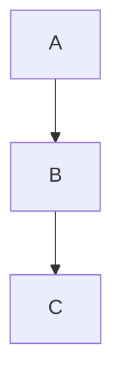

# `acp` CLI & MCP server

Publish agent-written (or hand-written) markdown to **Jira** and **Confluence**.

The model is **agent generates, tool publishes**: the AI/agent writes the markdown analysis,
then these tools post it to the n8n publish webhooks (`markdown-to-jira`, `markdown-to-confluence`),
which convert markdown → ADF/storage format and create-or-update the issues/pages. No AI runs in
the tool itself.

## Prerequisites

- Node 20+
- The n8n stack running with the publish workflows imported
  (`workflows/markdown-to-jira-pipeline.json`, `workflows/markdown-to-confluence-pipeline.json`)
- `.env` configured (`WEBHOOK_URL`, plus the `JIRA_*` / `CONFLUENCE_*` creds the n8n nodes use)

```bash
npm install     # also builds dist/ via the prepare script
npm run build   # or rebuild manually after changes
```

## Configuration

| Env var | Default | Meaning |
|---------|---------|---------|
| `WEBHOOK_URL` | `http://localhost:10353/webhook` | n8n webhook base URL (no trailing slash) — used by the **forward** publish flow |
| `ACP_BACKEND` | `n8n` | Backend for the **forward** publish flow. `n8n` (Stage 1). `direct` reserved for Stage 2 |
| `JIRA_BASE_URL` / `JIRA_EMAIL` / `JIRA_API_TOKEN` | — | Required by the **reverse** `pull-jira` flow (direct REST, Basic auth) |
| `CONFLUENCE_BASE_URL` / `CONFLUENCE_EMAIL` / `CONFLUENCE_API_TOKEN` | — | Required by the **reverse** `pull-confluence` flow (direct REST, Basic auth) |

## CLI

```bash
# Jira: Epic + linked Stories from markdown files
acp jira --epic epic.md --task task-api.md task-db.md
acp jira --epic epic.md --task task-*.md --dry-run            # preview payload, no call
acp jira --epic epic.md --epic-key PROJ-12 --task t1.md       # UPDATE existing epic
acp jira --epic epic.md --component Backend --assignee jane@acme.com

# Confluence: a page (+ optional appended sections)
acp confluence --page overview.md --section setup.md api.md
acp confluence --page overview.md --title "Architecture" --label tech --label adr
acp confluence --page overview.md --page-id 123456 --dry-run  # UPDATE existing page
```

`acp` and `ai-confluence-pipeline` are the same binary. `--dry-run` prints the resolved payload
without contacting n8n.

### Reverse: Jira / Confluence → markdown folder

The opposite direction. Give an epic key/URL (or Confluence page id/URL) and a target directory;
the issue/page tree is fetched via **direct REST** (no n8n), converted to markdown, and written as a
round-trippable folder (`epic.md` + `task-*.md` + nested sub-task folders, or `page.md` + nested
page folders), plus an `acp-pull.json` manifest carrying keys/ids, urls, status and parent links.

```bash
# Jira: pull an Epic + its Stories + Sub-tasks (recursive by default)
acp pull-jira PROJ-12 ./out
acp pull-jira https://you.atlassian.net/browse/PROJ-12 ./out --no-recursive --force

# Confluence: pull a page + its descendant page tree
acp pull-confluence 123456 ./out
acp pull-confluence https://you.atlassian.net/wiki/spaces/T/pages/123456/Title ./out --force
```

Bash/PowerShell wrappers: `scripts/jira-to-folder.sh`, `scripts/confluence-to-folder.sh` (+ `.ps1`).

### Re-publish a pulled folder (recursive round-trip)

Edit the markdown locally, then push the whole tree back — including sub-tasks and child pages,
which the flat n8n re-publish cannot express. `push-folder` reads `acp-pull.json`, converts each
file back (markdown → ADF / storage) via **direct REST**, and updates each issue/page in place
(manifest entries without a key/id are created, with parent links remapped):

```bash
acp push-folder ./out              # update the whole tree in place
acp push-folder ./out --dry-run    # show intended create/update actions, no calls
```

(The flat forward command still works for epic + stories: `acp jira --epic ./out/epic.md --task ./out/task-*.md`.)

### Interactive decisions (`acp questions`)

Turn an open-questions markdown (mermaid flow + a QA checklist) into a self-contained interactive HTML
(full guide: [QUESTIONS.md](QUESTIONS.md)).

```bash
acp questions open-questions.md          # → open-questions.html (mermaid inlined; offline)
acp questions oq.md --out d.html --cdn   # CDN mermaid (smaller); --link references the vendored copy
```

Answer in a browser → Export .md (decisions + diagram) → `acp confluence --page answers.md`.

### Business requirements → development-ready (`acp analyze`)

The full pipeline (guide: [TECH_ANALYSIS_FLOW.md](TECH_ANALYSIS_FLOW.md)) — one command after `acp trace init`:

```bash
acp pipeline                     # gather requirements → gaps → analyze → tech docs + Jira tasks + tagged tests
acp pipeline --ask               # two-pass: produce an open-questions form first; resolve, then --answers
```

…or the individual steps:

```bash
acp trace pull-requirements      # gather a MIX of sources → requirements/ folder + manifest
acp trace gaps                   # deterministic code-side gap (tag code with @KEY, add scope.code)
acp analyze                      # AI: gap analysis + technical-analysis (Confluence) + Jira tasks + tagged tests
acp analyze --publish-confluence --publish-jira   # …and push them to Confluence + Jira
```

`acp analyze` uses the configured AI provider (`AI_PROVIDER`/`AI_BASE_URL`/`AI_MODEL` + an API key);
the rest is deterministic. `acp trace scaffold-test <KEY>` / `status <KEY>` complete the agent loop.

### Task tracking (`katastasi task`)

```bash
katastasi task add "Implement login" --req PROJ-1   # → .acp/tasks/TASK-1.md (status, links)
katastasi task list [--status …] [--req …] [--drift --run]
katastasi task set TASK-1 done
katastasi task link TASK-1 --req PROJ-2 --test e2e/login@PROJ-1
katastasi task board                                # → .acp/BOARD.md (kanban + ⚠️ drift)
katastasi task verify --fail-on drift               # honesty gate (latest run; --run to refresh)
katastasi task import                               # mode: jira — read-only issue import
katastasi migrate                                   # move legacy root dirs into .acp/
```

Statuses + drift rule + mode are configured under `tasks` in `acp-trace.json`; see
[PHASE-1-DESIGN.md](PHASE-1-DESIGN.md).

### Requirements traceability (`acp trace`)

Link tests to requirements and report which requirements hold true at the current git commit
(full guide: [TRACEABILITY.md](TRACEABILITY.md)).

```bash
acp trace init                          # autodetect frameworks + requirements → acp-trace.json
acp trace serve                         # web portal: live dashboard + Run button + history (http://127.0.0.1:8787)
acp trace --config acp-trace.json       # write the markdown/HTML/JSON report
acp trace --config acp-trace.json --run                 # (re)run the suites first, then trace
acp trace --config acp-trace.json --fail-on regression  # CI gate: exit 1 on a regression vs last run
acp trace --config acp-trace.json --roadmap docs/roadmap.md      # fold a section into an existing doc
acp trace --config acp-trace.json --publish-confluence           # update the configured Confluence page
```

`acp trace` flags: `--config`, `--run`, `--no-save`, `--no-compare`, `--md/--html/--json`,
`--roadmap`/`--section`, `--publish-confluence`, `--stamp-jira` (label verified Jira issues), `--notify <url>`/`--notify-on` (webhook on regression),
`--fail-on none|regression|stale|drift|failing`.
`acp trace serve` flags: `--config`, `--port`, `--host`, `--watch`/`--interval` (auto-refresh as
results change), `--read-only`/`--pull`/`--pull-interval` (git-backed team dashboard),
`--token`/`--public` (shared-secret auth — required before exposing the portal beyond localhost; or
set `RTM_TOKEN`).

`acp trace collector` — a shared results backend: receives reports (`POST /ingest`) from every dev/CI
run and serves an aggregated multi-project dashboard (server of record, no Jira needed). Flags:
`--port`, `--host`, `--dir`, `--token`/`--public`, `--keep`. Projects post to it via `output.post` /
`--post http://collector:9000/ingest`.
`acp trace init` flags: `--project`, `--profile github|gitlab|jira|confluence|markdown|command`,
`--jira-epic`/`--markdown`/`--roadmap`/`--confluence-page` (skip autodetect), `--all` (org setup: token
+ compose + PR Action — see [ONBOARDING.md](ONBOARDING.md)), `--template`, `--out`, `--force`.

The portal exposes `GET /` (dashboard), `GET /api/report`, `GET /api/runs`, and `POST /run`
(`?run=1` executes suites, `?publish=1` updates Confluence) — so n8n/CI/agents can trigger runs too.

### Acceptance tests (`katastasi test`)

Run requirement-first acceptance cases (HTTP + CLI) and write JUnit results that `trace` ingests
(full guide: [ACCEPTANCE.md](ACCEPTANCE.md)).

```bash
katastasi test                          # run .acp/tests/*.acp.{json,yml,md} + inline ```acp-test blocks
katastasi test --req PROJ-1             # only this requirement
katastasi test --base-url http://stg    # override runner.baseUrl
katastasi test --specs "api/**/*.acp.json"   # override the spec globs
katastasi test --out results/acc.xml    # JUnit output path
katastasi trace                         # fold results into per-requirement status
```

`katastasi test` flags: `--config`, `--req`, `--base-url`, `--specs <globs...>`, `--out`,
`--fail-on none|fail` (default `fail`). Runner `baseUrl`/`headers`/`setup` come from the config `runner`
block; secrets are read from env via `{{env.NAME}}`.

### Feature wizard (`katastasi wizard`)

Guided idea→dev-ready-pack flow (full guide: [WIZARD-DESIGN.md](WIZARD-DESIGN.md); first-time Jira/Confluence
auth: [SOURCES_SETUP.md](SOURCES_SETUP.md)).

```bash
katastasi wizard                                  # interactive prompts (source / requirements / feature)
katastasi wizard --feature "Login" --source jira --requirements pull   # scriptable
katastasi wizard --feature "Login" --source none --no-analyze          # no AI; requirements-only pack
katastasi wizard check --source both              # credential doctor (what's missing + how to fix)
```

`katastasi wizard` flags: `--config`, `--feature`, `--source jira|confluence|both|none`,
`--requirements new|pull|clean`, `--no-analyze`, `--base-url <url>` (woven into the curls),
`--publish-confluence`. Output: `.acp/features/<name>/feature-pack.html` + `feature-pack.md`.

Configure the generated curls in `acp-trace.json` so they're copy-paste-runnable:
```jsonc
"wizard": {
  "baseUrl": "http://localhost:8084",
  "fixtures": { "id": "42", "menuId": "m_7" }   // fills {id} / :id / {{id}} with real ids that have data
}
```

### Bidirectional sync (`katastasi sync`)

Reconcile `.acp/tasks ⇄ GitHub issues / Jira` 3-way (full guide: [SYNC.md](SYNC.md)).

```bash
katastasi sync                 # preview (no writes)
katastasi sync --apply         # push local-only + pull remote-only, flag conflicts
katastasi sync --apply --push-only   # or --pull-only
katastasi sync --binding tasks-github --apply
katastasi sync status          # recorded task↔remote links (no network)
```

`katastasi sync` flags: `--config`, `--apply`, `--push-only`, `--pull-only`, `--binding <id>`,
`--fail-on none|conflict`. Configure via a `sync` block in `acp-trace.json`; creds from env
(`GITHUB_TOKEN` / `JIRA_*`).

### Local web wizard (`katastasi web`)

The browser onboarding wizard — 100% local, no login (guide: [WEB-WIZARD-DESIGN.md](WEB-WIZARD-DESIGN.md)).

```bash
katastasi web                 # opens http://localhost:8799 (Connect → Source → … → Sync)
katastasi web --port 9000 --host 127.0.0.1
```

A loopback `node:http` server on the dev's machine + a self-contained page. The **Connect** step saves
Atlassian/GitHub creds to the local `.env` (tokens never leave the PC). Later steps (paste a Jira/Confluence
URL → discover related issues+pages → pull → design → review → sync) land in subsequent slices.

### Agent skills (`katastasi init-skills`)

Install Katastasi skills into any repo so Claude Code + GitHub Copilot can drive every action as
one-liners:

```bash
katastasi init-skills              # into the current repo
katastasi init-skills --dir ../other-service
```

Writes `.claude/skills/katastasi-{onboard,design,sync,trace,test,tasks}/SKILL.md` and a Katastasi block
in `.github/copilot-instructions.md` (idempotent — re-running refreshes it). Run it once per service.

## MCP server (for Claude / agents)

The server exposes two tools that take **raw markdown strings** (what an agent has in memory):

| Tool | Purpose |
|------|---------|
| `markdown_to_jira` | Create/update a Jira Epic + linked Stories. Args: `epicMarkdown`, `taskMarkdowns[]`, `epicKey?`, `taskKeys[]?`, `component?`, `assignee?`, `reporter?`, … |
| `markdown_to_confluence` | Create/update a Confluence page. Args: `pageMarkdown`, `title?`, `sectionMarkdowns[]?`, `pageId?`, `parentPageId?`, `labels[]?` |
| `jira_to_markdown` | **Reverse.** Pull a Jira Epic (+ Stories + Sub-tasks) into a markdown folder. Args: `epic`, `dir`, `recursive?`, `force?` (direct REST, needs `JIRA_*` in `.env`) |
| `confluence_to_markdown` | **Reverse.** Pull a Confluence page (+ descendant pages) into a markdown folder. Args: `page`, `dir`, `recursive?`, `force?` (direct REST, needs `CONFLUENCE_*` in `.env`) |
| `push_folder` | **Reverse re-publish.** Push a pulled folder (+ `acp-pull.json`) back, recursively (incl. sub-tasks / child pages). Args: `dir`, `dryRun?` (direct REST) |
| `questions_to_html` | **Decisions.** Generate the interactive decision HTML from an open-questions markdown. Args: `input`, `out?`, `cdn?`. Returns where it wrote + question/edge counts + any unmapped Q's. |
| `scaffold_test` | **Agent loop.** Write a framework-correct, key-tagged test stub for a requirement. Args: `key`, `configPath?`, `tech?`, `title?`. Pull ticket → scaffold → implement → trace. |
| `requirement_status` | **Agent loop.** One requirement's current state (verified/failing/…+drift/stale/tests). Args: `key`, `configPath?`. The quick "is KEY done?" check. |
| `pull_requirements` | **BA pipeline.** Gather requirements from all configured sources into one local folder + manifest. Args: `configPath?`, `dir?`, `force?`. |
| `analyze` | **BA pipeline.** AI gap analysis → technical-analysis page + Jira tasks + scaffolded tagged tests + **executable acceptance specs** (`.acp/tests/<KEY>.acp.json`, run via `test_run`). Args: `configPath?`, `out?`, `scaffold?`. |
| `task_add` / `task_list` / `task_set_status` / `task_link` / `task_board` | **Tasks.** Manage local `.acp/tasks` (link to requirements, set status, render the board). `task_list {drift:true}` cross-checks done tasks. |
| `task_import` | **Tasks.** Import Jira issues read-only into `.acp/tasks` (requires `tasks.mode: jira`). |

**Driving acp from Claude/Copilot:** register the MCP server and use the paste-ready flow prompts in
**[AGENT_PROMPT.md](AGENT_PROMPT.md)** (implement-a-ticket-with-verification; requirements → use cases
as a mermaid flow → unit + e2e tests → trace).
| `requirements_trace` | **Traceability.** Build the RTM from an `acp-trace.json`: which requirements are verified / failing / unverified / specified + drift + orphan tests + regressions vs the last run, at the current git commit. Args: `configPath?`, `format?` (`markdown`\|`json`), `run?` (re-run the suites first). Returns the report + structured stats. |
| `test_run` | **Acceptance.** Run requirement-first acceptance tests (HTTP + CLI) from `.acp/tests` specs + inline ` ```acp-test ` blocks, write JUnit keyed by requirement (then call `requirements_trace` to flip verified). Args: `configPath?`, `req?`, `baseUrl?`, `out?`. Returns per-case pass/fail + the results path. |
| `sync_preview` / `sync_apply` | **Sync.** Reconcile `.acp/tasks ⇄ GitHub issues / Jira` 3-way; preview reports push/pull/conflict, apply writes the safe subset (conflicts → `.acp/sync/conflicts/`). Args: `configPath?`, `direction?` (both\|push\|pull), `binding?`. Creds from env. |
| `feature_wizard` | **Wizard.** Idea + requirements (Jira/Confluence/markdown) + code → a dev-ready feature pack: system + per-use-case mermaid, ordered context-rich tasks, unit/e2e/acceptance stubs + ready-made curls → a self-contained `feature-pack.html` (+ markdown, + optional Confluence). Generates only. Args: `feature`, `source?`, `requirements?`, `analyze?`, `configPath?`, `publishConfluence?`. |

### Register in Claude Code

A project-scoped `.mcp.json` is already committed at the repo root:

```json
{
  "mcpServers": {
    "ai-confluence-pipeline": { "command": "node", "args": ["dist/mcp/server.js"] }
  }
}
```

Run Claude Code from the repo root (so `dist/` and `.env` resolve), or point `args` at an absolute path.

### Use anywhere (published / npx)

Once published to npm:

```jsonc
{
  "mcpServers": {
    "ai-confluence-pipeline": {
      "command": "npx",
      "args": ["-y", "ai-confluence-pipeline", "acp-mcp"],
      "env": { "WEBHOOK_URL": "https://your-n8n/webhook" }
    }
  }
}
```

## Markdown format (recognised sections)

```markdown
# Title (required — becomes the Jira summary / Confluence title)

Body paragraphs…

## Acceptance Criteria
- Given X, when Y, then Z

## Priority
High

## Component
Backend

## Labels
auth, security
```

Tables, code blocks, task lists and links are converted to ADF / Confluence storage.

### Mermaid diagrams

A fenced ` ```mermaid ` block is supported in both directions, both products:

````markdown

````

- **Jira** — becomes an ADF `codeBlock` with `language: mermaid` (renders if a Jira mermaid app is
  installed; the source is always preserved). Round-trips back to a ` ```mermaid ` fence on pull.
- **Confluence** — becomes a mermaid macro (`CONFLUENCE_MERMAID_MACRO`, default `mermaid-cloud` —
  the free "Mermaid Diagrams for Confluence" app) with the source in the macro body. Renders if that
  app is installed, and any `mermaid*` macro round-trips back to a ` ```mermaid ` fence on pull.

Because the source lives in the code block / macro body (not a flattened image), `pull → edit → push`
keeps the diagram intact.

## Docker

The CLI + MCP server ship as a Docker image; a script streams it to a remote host with no registry
(`docker save | gzip | ssh 'gunzip | docker load'`). See **[docs/DOCKER.md](DOCKER.md)**.

```bash
./scripts/docker-build.sh
./scripts/docker-deploy-remote.sh user@host --env-file .env
```

## Roadmap

- **Reverse pipeline (done):** `pull-jira` / `pull-confluence` (+ `jira_to_markdown` /
  `confluence_to_markdown` MCP tools) pull issues/pages into markdown via direct REST.
- **Recursive re-publish (done):** `push-folder` (+ `push_folder` MCP tool) reads `acp-pull.json`
  and updates the whole tree in place (incl. sub-tasks / child pages) via direct REST. The TS
  forward converters (`markdownToAdf` / `markdownToStorage`, ported from the n8n Code nodes) make
  this self-contained.
- **Mermaid (done):** ` ```mermaid ` blocks render via ADF code block (Jira) / configurable macro
  (Confluence), round-tripping in both directions; n8n publish path patched to match.
- **Docker (done):** image + `scripts/docker-build.*` + `scripts/docker-deploy-remote.*` (SSH
  save/load, no registry). See [docs/DOCKER.md](DOCKER.md).
- **Stage 2 (forward direct, remaining):** wire `ACP_BACKEND=direct` into the *publish* commands
  (`acp jira` / `acp confluence`) so they reuse the now-ported TS converters instead of n8n.
- Deferred: `run_analysis` tool (AI generation via the n8n preview pipeline).
