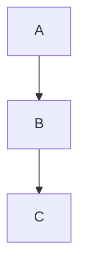

# `acp` CLI & MCP server

Publish agent-written (or hand-written) markdown to **Jira** and **Confluence**.

The model is **agent generates, tool publishes**: the AI/agent writes the markdown analysis,
then these tools post it to the n8n publish webhooks (`markdown-to-jira`, `markdown-to-confluence`),
which convert markdown → ADF/storage format and create-or-update the issues/pages. No AI runs in
the tool itself.

## Prerequisites

- Node 20+
- The n8n stack running with the publish workflows imported
  (`workflows/markdown-to-jira-pipeline.json`, `workflows/markdown-to-confluence-pipeline.json`)
- `.env` configured (`WEBHOOK_URL`, plus the `JIRA_*` / `CONFLUENCE_*` creds the n8n nodes use)

```bash
npm install     # also builds dist/ via the prepare script
npm run build   # or rebuild manually after changes
```

## Configuration

| Env var | Default | Meaning |
|---------|---------|---------|
| `WEBHOOK_URL` | `http://localhost:10353/webhook` | n8n webhook base URL (no trailing slash) — used by the **forward** publish flow |
| `ACP_BACKEND` | `n8n` | Backend for the **forward** publish flow. `n8n` (Stage 1). `direct` reserved for Stage 2 |
| `JIRA_BASE_URL` / `JIRA_EMAIL` / `JIRA_API_TOKEN` | — | Required by the **reverse** `pull-jira` flow (direct REST, Basic auth) |
| `CONFLUENCE_BASE_URL` / `CONFLUENCE_EMAIL` / `CONFLUENCE_API_TOKEN` | — | Required by the **reverse** `pull-confluence` flow (direct REST, Basic auth) |

## CLI

```bash
# Jira: Epic + linked Stories from markdown files
acp jira --epic epic.md --task task-api.md task-db.md
acp jira --epic epic.md --task task-*.md --dry-run            # preview payload, no call
acp jira --epic epic.md --epic-key PROJ-12 --task t1.md       # UPDATE existing epic
acp jira --epic epic.md --component Backend --assignee jane@acme.com

# Confluence: a page (+ optional appended sections)
acp confluence --page overview.md --section setup.md api.md
acp confluence --page overview.md --title "Architecture" --label tech --label adr
acp confluence --page overview.md --page-id 123456 --dry-run  # UPDATE existing page
```

`acp` and `ai-confluence-pipeline` are the same binary. `--dry-run` prints the resolved payload
without contacting n8n.

### Reverse: Jira / Confluence → markdown folder

The opposite direction. Give an epic key/URL (or Confluence page id/URL) and a target directory;
the issue/page tree is fetched via **direct REST** (no n8n), converted to markdown, and written as a
round-trippable folder (`epic.md` + `task-*.md` + nested sub-task folders, or `page.md` + nested
page folders), plus an `acp-pull.json` manifest carrying keys/ids, urls, status and parent links.

```bash
# Jira: pull an Epic + its Stories + Sub-tasks (recursive by default)
acp pull-jira PROJ-12 ./out
acp pull-jira https://you.atlassian.net/browse/PROJ-12 ./out --no-recursive --force

# Confluence: pull a page + its descendant page tree
acp pull-confluence 123456 ./out
acp pull-confluence https://you.atlassian.net/wiki/spaces/T/pages/123456/Title ./out --force
```

Bash/PowerShell wrappers: `scripts/jira-to-folder.sh`, `scripts/confluence-to-folder.sh` (+ `.ps1`).

### Re-publish a pulled folder (recursive round-trip)

Edit the markdown locally, then push the whole tree back — including sub-tasks and child pages,
which the flat n8n re-publish cannot express. `push-folder` reads `acp-pull.json`, converts each
file back (markdown → ADF / storage) via **direct REST**, and updates each issue/page in place
(manifest entries without a key/id are created, with parent links remapped):

```bash
acp push-folder ./out              # update the whole tree in place
acp push-folder ./out --dry-run    # show intended create/update actions, no calls
```

(The flat forward command still works for epic + stories: `acp jira --epic ./out/epic.md --task ./out/task-*.md`.)

### Requirements traceability (`acp trace`)

Link tests to requirements and report which requirements hold true at the current git commit
(full guide: [TRACEABILITY.md](TRACEABILITY.md)).

```bash
acp trace init --project "My Product" --jira-epic PROJ-100   # scaffold acp-trace.json
acp trace --config acp-trace.json                            # write the markdown/HTML/JSON report
acp trace --config acp-trace.json --fail-on drift            # CI gate (exit 1 on drift/failing)
acp trace --config acp-trace.json --roadmap docs/roadmap.md  # also fold a section into an existing doc
acp trace --config acp-trace.json --publish-confluence       # also update the configured Confluence page
```

Flags: `--config`, `--md/--html/--json` (override output paths), `--roadmap`/`--section`,
`--publish-confluence`, `--fail-on none|drift|failing`. `acp trace init` flags: `--out`, `--project`,
`--jira-epic`, `--markdown`, `--roadmap`, `--confluence-page`, `--force`.

## MCP server (for Claude / agents)

The server exposes two tools that take **raw markdown strings** (what an agent has in memory):

| Tool | Purpose |
|------|---------|
| `markdown_to_jira` | Create/update a Jira Epic + linked Stories. Args: `epicMarkdown`, `taskMarkdowns[]`, `epicKey?`, `taskKeys[]?`, `component?`, `assignee?`, `reporter?`, … |
| `markdown_to_confluence` | Create/update a Confluence page. Args: `pageMarkdown`, `title?`, `sectionMarkdowns[]?`, `pageId?`, `parentPageId?`, `labels[]?` |
| `jira_to_markdown` | **Reverse.** Pull a Jira Epic (+ Stories + Sub-tasks) into a markdown folder. Args: `epic`, `dir`, `recursive?`, `force?` (direct REST, needs `JIRA_*` in `.env`) |
| `confluence_to_markdown` | **Reverse.** Pull a Confluence page (+ descendant pages) into a markdown folder. Args: `page`, `dir`, `recursive?`, `force?` (direct REST, needs `CONFLUENCE_*` in `.env`) |
| `push_folder` | **Reverse re-publish.** Push a pulled folder (+ `acp-pull.json`) back, recursively (incl. sub-tasks / child pages). Args: `dir`, `dryRun?` (direct REST) |
| `requirements_trace` | **Traceability.** Build the RTM from an `acp-trace.json`: which requirements are verified / failing / unverified / specified + drift + orphan tests, at the current git commit. Args: `configPath?`, `format?` (`markdown`\|`json`). Returns the report + structured stats. |

### Register in Claude Code

A project-scoped `.mcp.json` is already committed at the repo root:

```json
{
  "mcpServers": {
    "ai-confluence-pipeline": { "command": "node", "args": ["dist/mcp/server.js"] }
  }
}
```

Run Claude Code from the repo root (so `dist/` and `.env` resolve), or point `args` at an absolute path.

### Use anywhere (published / npx)

Once published to npm:

```jsonc
{
  "mcpServers": {
    "ai-confluence-pipeline": {
      "command": "npx",
      "args": ["-y", "ai-confluence-pipeline", "acp-mcp"],
      "env": { "WEBHOOK_URL": "https://your-n8n/webhook" }
    }
  }
}
```

## Markdown format (recognised sections)

```markdown
# Title (required — becomes the Jira summary / Confluence title)

Body paragraphs…

## Acceptance Criteria
- Given X, when Y, then Z

## Priority
High

## Component
Backend

## Labels
auth, security
```

Tables, code blocks, task lists and links are converted to ADF / Confluence storage.

### Mermaid diagrams

A fenced ` ```mermaid ` block is supported in both directions, both products:

````markdown

````

- **Jira** — becomes an ADF `codeBlock` with `language: mermaid` (renders if a Jira mermaid app is
  installed; the source is always preserved). Round-trips back to a ` ```mermaid ` fence on pull.
- **Confluence** — becomes a mermaid macro (`CONFLUENCE_MERMAID_MACRO`, default `mermaid-cloud` —
  the free "Mermaid Diagrams for Confluence" app) with the source in the macro body. Renders if that
  app is installed, and any `mermaid*` macro round-trips back to a ` ```mermaid ` fence on pull.

Because the source lives in the code block / macro body (not a flattened image), `pull → edit → push`
keeps the diagram intact.

## Docker

The CLI + MCP server ship as a Docker image; a script streams it to a remote host with no registry
(`docker save | gzip | ssh 'gunzip | docker load'`). See **[docs/DOCKER.md](DOCKER.md)**.

```bash
./scripts/docker-build.sh
./scripts/docker-deploy-remote.sh user@host --env-file .env
```

## Roadmap

- **Reverse pipeline (done):** `pull-jira` / `pull-confluence` (+ `jira_to_markdown` /
  `confluence_to_markdown` MCP tools) pull issues/pages into markdown via direct REST.
- **Recursive re-publish (done):** `push-folder` (+ `push_folder` MCP tool) reads `acp-pull.json`
  and updates the whole tree in place (incl. sub-tasks / child pages) via direct REST. The TS
  forward converters (`markdownToAdf` / `markdownToStorage`, ported from the n8n Code nodes) make
  this self-contained.
- **Mermaid (done):** ` ```mermaid ` blocks render via ADF code block (Jira) / configurable macro
  (Confluence), round-tripping in both directions; n8n publish path patched to match.
- **Docker (done):** image + `scripts/docker-build.*` + `scripts/docker-deploy-remote.*` (SSH
  save/load, no registry). See [docs/DOCKER.md](DOCKER.md).
- **Stage 2 (forward direct, remaining):** wire `ACP_BACKEND=direct` into the *publish* commands
  (`acp jira` / `acp confluence`) so they reuse the now-ported TS converters instead of n8n.
- Deferred: `run_analysis` tool (AI generation via the n8n preview pipeline).
